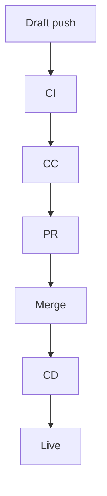

# ai-tech-blog-pipeline  \ud83d\udd84
**Next.js 15.3 \xd7 AI** \u3067\u3001Markdown \u30a2\u30a6\u30c8\u30e9\u30a4\u30f3\u3092 push \u3059\u308b\u3060\u3051\u3067
\u30d5\u30eb\u8a18\u4e8b + \u753b\u50cf + \u52d5\u753b\u3092\u751f\u6210\u3057\u3001\u81ea\u52d5\u30c7\u30d7\u30ed\u30a4\u3059\u308b Tech \u30d6\u30ed\u30b0\u7528\u30b9\u30bf\u30fc\u30bf\u30fc\u3002


## \u2728 Features
- **Next.js 15.3 & MDX**
- \u5b8c\u5168\u81ea\u52d5 **CI \u2192 CC \u2192 CD** \u30d1\u30a4\u30d7\u30e9\u30a4\u30f3
- **GPT-4o** \u3067\u672c\u6587\u3001**FluxPro** \u3067\u30d2\u30fc\u30ed\u30fc\u753b\u50cf\u3001**Kling** \u3067\u52d5\u753b
- Turbopack \u03b1 \u5bfe\u5fdc (\u4efb\u610f)

## \ud83d\ude80 Quick Start
```bash
git clone https://github.com/<org>/ai-tech-blog-pipeline.git
cd ai-tech-blog-pipeline
npm i
# add secrets then push your first outline
```

## \ud83d\uddbc Architecture



## \u2753 FAQ

| Q          | A                                            |
| ---------- | -------------------------------------------- |
| \u753b\u50cf\u751f\u6210\u306e\u30b3\u30b9\u30c8\u306f? | FluxPro \u7121\u6599\u67a0\u5185\u306a\u3089 1k\xd71k \u753b\u50cf 50 \u679a/月 \u304c\u7121\u6599\u3067\u3059         |
| \u52d5\u753b\u751f\u6210\u304c\u9045\u3044!   | Kling CLI \u306b `--resolution 480` \u3092\u4ed8\u3051\u3066\u8a66\u3059\u3068\u901f\u304f\u306a\u308a\u307e\u3059 |

---
Happy shipping with **ai-tech-blog-pipeline** \ud83d\ude80

